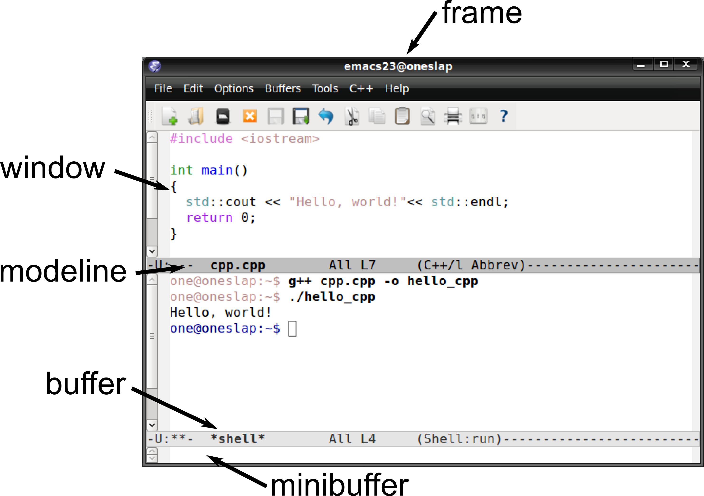

# 100% Emacs: How to Do Everything In Emacs

A whistle-stop tour on how to do (almost) everything with Emacs.

Working with various different codes in various different languages, along with writing
presentations, talks and papers, I spend most of my day writing text, just with different
syntaxes. As such, I like to be able to do it all in the same program -- and that program
is Emacs. This is a wide-but-shallow introduction on how to work with a multitude of text
and software projects solely using Emacs.

## Overview

0. Intro
1. [Customising Emacs and installing additional packages](1-packages.org)
2. [Interacting with git](2-magit.org)
3. [General purpose text -- notes, to-do lists, documents](3-org_tutorial.org)
4. [Navigating generic projects](4-helm_and_projectile.org)
5. [Software projects](5-programming_languages.org)

# Why Emacs?

- It's the best
- Many, many features out-of-the-box
- Incredibly extensible and powerful
- Great for tinkerers

# Terminology/anatomy

- Emacs development began in 1970s, before Windows/MS Office
- Names of things can be a little different
- Shortcuts for copy, paste, etc. very different
	- "kill" == "cut"
	- "yank" == "paste"
- Helps to see original keyboard:

[By Retro-Computing Society of Rhode Island - Own work, CC BY-SA 3.0](https://commons.wikimedia.org/w/index.php?curid=3388741)

- If you've not done so before, it is **enormously** useful to go through the tutorial
	- `Help > Emacs tutorial`
- I'll cover some absolute basics here!

## Windows and frames

[By Original uploaded by: Praveep - Transferred from ml.wikipedia to Commons by Sreejithk2000 using CommonsHelper., GPL](https://commons.wikimedia.org/w/index.php?curid=12584006)

## Buffers

From the manual (`C-h r`):

> The text you are editing in Emacs resides in an object called a
> “buffer”.  Each time you visit a file, a buffer is used to hold the
> file’s text.  Each time you invoke Dired, a buffer is used to hold the
> directory listing.  If you send a message with ‘C-x m’, a buffer is used
> to hold the text of the message.  When you ask for a command’s
> documentation, that appears in a buffer named ‘*Help*’.

## Major Modes

- Only one per buffer
- Specialised behaviour for particular file or buffer types
	- e.g. C source code, or compilation buffer

## Minor modes

- Optional features,  can have multiple per buffer
	- e.g. auto-fill mode for automatically inserting line breaks, or flyspell mode for spell-checking
- Some are "buffer-local", i.e. can be turned on/off per buffer
- Some are "global", i.e. turned on/off for all buffers at once

## Vim-like modal editing and keybindins

- Evil mode (extensible vi layer for Emacs)
- Spacemacs
- Doom

## Basic commands

- `C` means Ctrl, `M` means Alt (Meta)
- In terminals, `C-M-` combos might be hard to type, so you can use `C-[ C-` instead
- Lots of commands can take a "prefix argument": press `C-u` before the rest of the
  shortcut or command to use optional arguments
	- e.g. `C-u 4 C-b`: move four characters backwards
- Rebinding Caps lock as an extra ctrl can be useful:
  <https://www.emacswiki.org/emacs/MovingTheCtrlKey>
- Eval any elisp commands anywhere with `C-x C-e`
- `C-g`: general purpose "cancel"

# Movement you might not know

## Lines

- `M-m`: move to first non-whitespace character on line

## Brackets

- `C-M-f`, `C-M-b`: move over balanced brackets
- `C-M-<space>`: selected balanced brackets

## Functions

- `C-M-a`, `C-M-e`: move over functions
- `C-M-h`: select whole function

# Getting help

## Help functions

- `C-h f` help on functions
- `C-h v` help on variables
- `C-h l` key stroke history (possibly with command names!)
- `C-h m` help on current major mode (keybindings and useful functions)

## Outside Emacs:

- <https://emacs.stackexchange.com/> *Q&A site*
- <https://www.emacswiki.org/> *Generally good first stop*
- <https://tuhdo.github.io/> *In-depth tutorial*

# Beyond the basics

## emacsclient

- In bash, set the environment variable `EDITOR` to `emacsclient`, and
  do `M-x server-start` inside an existing emacs session
- Now when other programs need to open `$EDITOR`, it will open in your
  existing emacs session

## TRAMP

- Open remote files by prepending the path with `/ssh:username@host:`
- Also works with sudo: `/sudo:localhost:`
- And sudo over ssh: `/ssh:you@remotehost|sudo:remotehost:/path/to/file`

## Shell commands

- Emacs can not only run shell commands, but it also features three types of terminal
  emulators!
- `M-!` to just run a command and display the output
	- e.g. `M-! date`
- `M-|` to run a command using the region as input
	- e.g. `M-| wc -c` to count characters in region
- `M-x shell`, `M-x term`, `M-x eshell` for a terminal emulator
	- `shell` is the most basic, essentially just a terminal in an ordinary Emacs buffer,
	  useful if you need to then manipulate the output of a command
	- `term` is a fully featured terminal, useful for when you just need to do something
	  in bash -- you probably want this one!
	- `eshell` is a shell written in elisp, and so is most useful when you need a closer
	  interaction between Emacs and external processes
